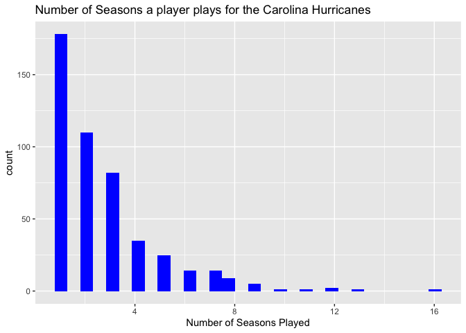
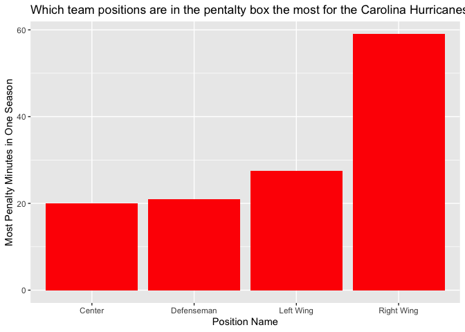
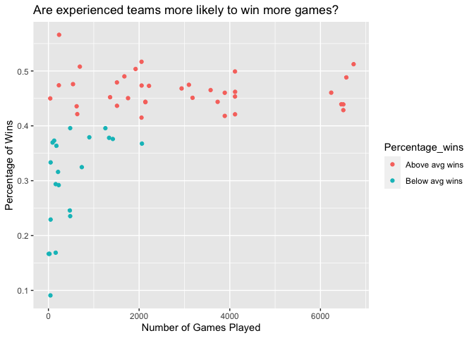
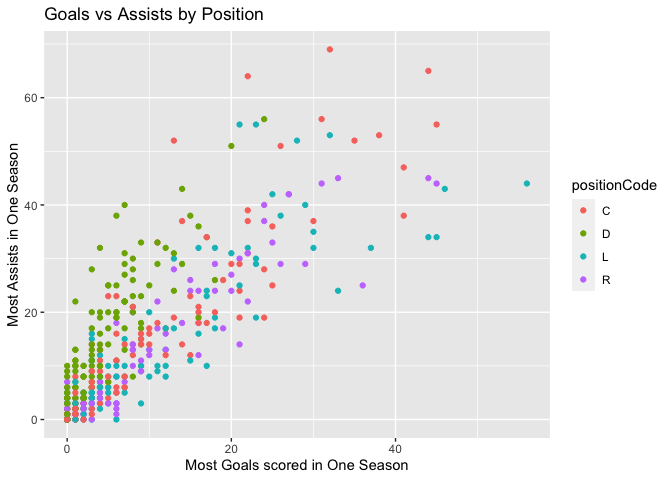
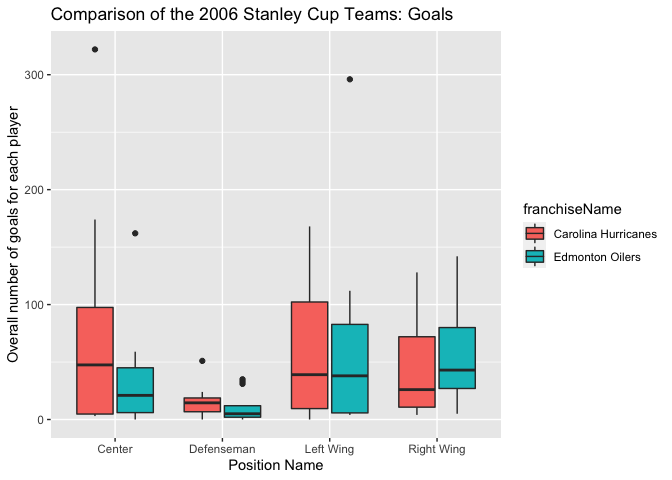
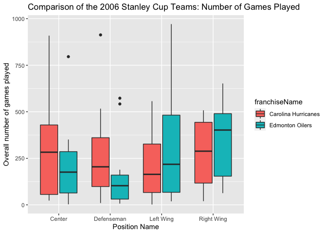
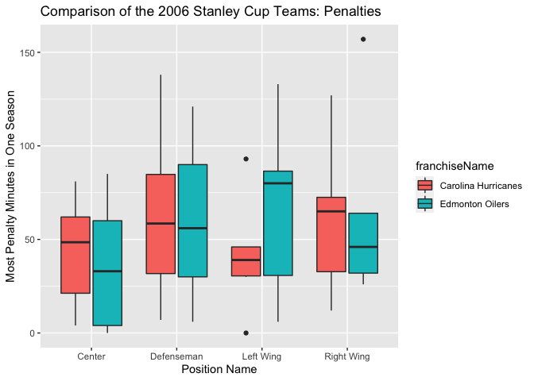

Project 1- Hockey- Colleen Moore
================
9/14/2020

# Required Packages

The required packages to run the functions in this project are
`tidyverse`, `jsonlite`, and `httr`. The `jsonlite` and `httr` packages
are used to access the api’s. `tidyverse` is used to more for data
analysis.

# Write Functions to contact the [NHL records API](https://gitlab.com/dword4/nhlapi/-/blob/master/records-api.md)

The five functions below to acess various parts of the the NHL records
api. Data is returned in a data frame format for ease of analysis.

## `franchaise` function

Returns the franchise information. The columns returned by this function
include: <br>

  - Id
  - First season ID
  - Last season ID
  - Most recent team ID
  - Team common name
  - Team place name
  - Total

The information returned is in the format of a data table.

``` r
franchaise <- function(fran){
  url<- "https://records.nhl.com/site/api/franchise"
  fran_get<- content(GET(url), "text")
  fran_json<- fromJSON(fran_get, flatten= T, simplifyDataFrame = T)
  fran_df<- as.data.frame(fran_json)
  colnames(fran_df) <- str_remove(colnames(fran_df), "data.")
  return(fran_df)
}
```

## `fran_team_totals` function

Accesses the franchise team totals This function returns Total stats for
every franchise (ex roadTies, roadWins, etc)

``` r
fran_team_totals<- function(fran_team) {
  url<- "https://records.nhl.com/site/api/franchise-team-totals"
  franTT_get<- content(GET(url), "text")
  franTT_json<- fromJSON(franTT_get, flatten= T, simplifyDataFrame = T)
  franTT_df<- as.data.frame(franTT_json)
  colnames(franTT_df) <- str_remove(colnames(franTT_df), "data.")
  return(franTT_df)
}
```

## `team_data` function

Accesses team specific season records by team number or by common team
name. In order to be able to acces the team common name I had to refer
to my previous function above, the franchaise function, that links up
the team common name and the franchaise id. This function returns
information on a specific team such as:

  - Fewest losses
  - Fewest wins
  - Most game goals
  - Winning Streak
  - as well as a whole lot more information

<!-- end list -->

``` r
team_data<- function(team){
  if(is.character(team)){
    team_no<- franchaise() %>% select(id, teamCommonName)%>% filter(teamCommonName== team)%>% select(id)
    base_url<- "https://records.nhl.com/site/api/franchise-season-records?cayenneExp=franchiseId="
    url<- paste0(base_url,team_no)
    team_get<- content(GET(url), "text")
    team_json<- fromJSON(team_get, flatten= T, simplifyDataFrame = T)
    team_df<- as.data.frame(team_json)
    colnames(team_df) <- str_remove(colnames(team_df), "data.")
  return(team_df)
  }
  if(is.numeric(team)){
  base_url<- "https://records.nhl.com/site/api/franchise-season-records?cayenneExp=franchiseId="
  url<- paste0(base_url,team)
  team_get<- content(GET(url), "text")
  team_json<- fromJSON(team_get, flatten= T, simplifyDataFrame = T)
  team_df<- as.data.frame(team_json)
  colnames(team_df) <- str_remove(colnames(team_df), "data.")
  return(team_df)
  }
}
```

## `Goldie_data` function

Accesses Goalie records for the specified team entering either the
franchaise ID number or the common team name The function appears to
return statistic information on each individual goldie that played for a
specific franchaise. It returns information such as: <br>

  - most goals saved in one game
  - number of seasons played
  - most shout out in one season
  - etc

<!-- end list -->

``` r
Goalie_data<- function(team){
  if(is.character(team)){
   team_no<- franchaise() %>% select(id, teamCommonName)%>% filter(teamCommonName== team)%>% select(id)
    base_url<- "https://records.nhl.com/site/api/franchise-goalie-records?cayenneExp=franchiseId="
    url<- paste0(base_url, team_no)
    Gteam_get<- content(GET(url), "text")
    Gteam_json<- fromJSON(Gteam_get, flatten= T, simplifyDataFrame = T)
    Gteam_df<- as.data.frame(Gteam_json)
    colnames(Gteam_df) <- str_remove(colnames(Gteam_df), "data.")
  return(Gteam_df)
  }
  if(is.numeric(team)){
  base_url<- "https://records.nhl.com/site/api/franchise-goalie-records?cayenneExp=franchiseId="
  url<- paste0(base_url,team)
  Gteam_get<- content(GET(url), "text")
  Gteam_json<- fromJSON(Gteam_get, flatten= T, simplifyDataFrame = T)
  Gteam_df<- as.data.frame(Gteam_json)
  colnames(Gteam_df) <- str_remove(colnames(Gteam_df), "data.")
  return(Gteam_df)
  }
}
```

## `Skater_data` function

Accesses skater records for the specified team entering either the
franchaise ID number or the common team name. This function returns
information such as:

  - Players names
  - Number of games played
  - Numer of goals made
  - Number of assists
  - Number of seasons played
  - etc

<!-- end list -->

``` r
Skater_data<- function(team){
  if(is.character(team)){
    team_no<- franchaise() %>% select(id, teamCommonName)%>% filter(teamCommonName== team)%>% select(id)
    base_url<- "https://records.nhl.com/site/api/franchise-skater-records?cayenneExp=franchiseId="
    url<- paste0(base_url, team_no)
    Steam_get<- content(GET(url), "text")
    Steam_json<- fromJSON(Steam_get, flatten= T, simplifyDataFrame = T)
    Steam_df<- as.data.frame(Steam_json)
    colnames(Steam_df) <- str_remove(colnames(Steam_df), "data.")
  return(Steam_df)
  }
  if(is.numeric(team)){
  base_url<- "https://records.nhl.com/site/api/franchise-skater-records?cayenneExp=franchiseId="
  url<- paste0(base_url,team)
  Steam_get<- content(GET(url), "text")
  Steam_json<- fromJSON(Steam_get, flatten= T, simplifyDataFrame = T)
  Steam_df<- as.data.frame(Steam_json)
  colnames(Steam_df) <- str_remove(colnames(Steam_df), "data.")
  return(Steam_df)
  }
}
```

## Access the stats API

Write a function to access the [NHL stats
API](https://gitlab.com/dword4/nhlapi/-/blob/master/stats-api.md) Be
able to get information corresponding to:

1.  **active team roster for a specific team** <br> sepcify: stat\_api=
    “roster” and a team number or team common name
2.  **active team roster for a specific team with less information**<br>
    specify: stat\_api= “less\_roster” and a team number or team common
    name
3.  **details of upcoming game for a team**<br> specify: stat\_api=
    “schedule” and a team number or team common name
4.  **details of last game played** <br> specify: stat\_api= “prev\_sch”
    and a team number or team common name
5.  **Team stats for the season** <br> specify: stat\_api= “stats” and a
    team number or team common name
6.  **Team roster for a season** <br> specify: stat\_api= “season”, a
    team number or team common name, and the start of the season year of
    interest (year1= )
7.  **Multiple team Stats**<br> specify: stat\_api= “mult\_teams” This
    function allows you to compare up to 5 teams by team number.
8.  **Specify which stats to get**<br> specify: stat\_api=
    “specific\_stats”, for example, if I was interested in Single
    season playoffs I could enter stat= SingleSeasonPlayoffs.The
    documentation for the function does not include what specific stats
    you can get.

Notes: Have to enter the stat\_api in quotes… so stat\_api= “roster”

Make a table with the ID, common team name, and franchaise ID to
reference in functions. The stat API works on team number while the NHL
records API works on franchaise numbers.

``` r
team_url<- "https://statsapi.web.nhl.com/api/v1/teams/"
team_get<- content(GET(team_url), "text")
team_JSON<- fromJSON(team_get, flatten= T, simplifyDataFrame = T)
team_df<- as.data.frame(team_JSON)
colnames(team_df) <- str_remove(colnames(team_df), "teams.")
reference_table<- team_df %>% select(id, teamName, franchiseId)
```

Function allows you to specify either the team number or the teams
common
name.

``` r
stats_data<- function(team, stat_api, year1=NULL, stat= NULL, team2= NULL, team3= NULL, team4= NULL, team5= NULL){
  if(is.character (team)){
  team<- reference_table %>% filter(teamName== team)%>% select(id)
  }
  if(stat_api== "roster"){
  base_url<- "https://statsapi.web.nhl.com/api/v1/teams/"
  url<- paste0(base_url, team,"?expand=team.roster" )
  stat_team_get<- content(GET(url), "text")
  stat_team_json<- fromJSON(stat_team_get, flatten= T, simplifyDataFrame = T)
  stat_team_df<- as.data.frame(stat_team_json)
  return(stat_team_df$teams.roster.roster[[1]])
  }
  if(stat_api== "less_roster"){
  base_url<- "https://statsapi.web.nhl.com/api/v1/teams/"
  url<- paste0(base_url, team,"?expand=person.names")
  stat_team_get<- content(GET(url), "text")
  stat_team_json<- fromJSON(stat_team_get, flatten= T, simplifyDataFrame = T)
  stat_team_df<- as.data.frame(stat_team_json)
  return(stat_team_df)
  }
  if(stat_api== "schedule"){
  base_url<- "https://statsapi.web.nhl.com/api/v1/teams/"
  url<- paste0(base_url, team,"?expand=team.schedule.next")
  stat_team_get<- content(GET(url), "text")
  stat_team_json<- fromJSON(stat_team_get, flatten= T, simplifyDataFrame = T)
  stat_team_df<- as.data.frame(stat_team_json)
  return(stat_team_df)
  }
  if(stat_api== "prev_sch"){
  base_url<- "https://statsapi.web.nhl.com/api/v1/teams/"
  url<- paste0(base_url, team,"?expand=team.schedule.previous")
  stat_team_get<- content(GET(url), "text")
  stat_team_json<- fromJSON(stat_team_get, flatten= T, simplifyDataFrame = T)
  stat_team_df<- as.data.frame(stat_team_json)
  return(stat_team_df$teams.previousGameSchedule.dates[[1]][[6]][[1]])
  }
  if(stat_api== "stats"){
  base_url<- "https://statsapi.web.nhl.com/api/v1/teams/"
  url<- paste0(base_url, team,"?expand=team.stats")
  stat_team_get<- content(GET(url), "text")
  stat_team_json<- fromJSON(stat_team_get, flatten= T, simplifyDataFrame = T)
  stat_team_df<- as.data.frame(stat_team_json)
  return((stat_team_df[[9]][[1]])[[1]][[1]])
  }
  if(stat_api== "season"){
  year2<- year1 + 1
  base_url<- "https://statsapi.web.nhl.com/api/v1/teams/"
  url<- paste0(base_url, team,"?expand=team.roster&season=", year1,year2)
  stat_team_get<- content(GET(url), "text")
  stat_team_json<- fromJSON(stat_team_get, flatten= T, simplifyDataFrame = T)
  stat_team_df<- as.data.frame(stat_team_json)
  return(stat_team_df$teams.roster.roster[[1]])
  }
  if(stat_api== "mult_teams"){
  base_url<- "https://statsapi.web.nhl.com/api/v1/teams/"
  url<- paste0(base_url,"?teamId=", team,",", team2,",", team3,",", team4,",", team5)
  stat_team_get<- content(GET(url), "text")
  stat_team_json<- fromJSON(stat_team_get, flatten= T, simplifyDataFrame = T)
  stat_team_df<- as.data.frame(stat_team_json)
  return(stat_team_df)
  }
  if(stat_api== "specific_stats"){
  base_url<- "https://statsapi.web.nhl.com/api/v1/teams/"
  url<- paste0(base_url,team, "?stats=stats", stat)
  stat_team_get<- content(GET(url), "text")
  stat_team_json<- fromJSON(stat_team_get, flatten= T, simplifyDataFrame = T)
  stat_team_df<- as.data.frame(stat_team_json)
  return(stat_team_df)
  }
}
```

I tested each function above and each one seems to work fine.

``` r
a<- stats_data(stat_api= "schedule", team= 54)
```

## Wrapper Function

This function is able to call any of the functions above in this
project. The function name as well as the arguments needed for the
function have to be supplied. So for example if you wanted goalie data
for the Carolina Hurricanes, you would have to enter: <br>
NHL\_master(func= “Goalie\_data”, team=
“Hurricanes”)

``` r
NHL_master<- function(func, team, stat_api= NULL, year1=NULL, stat= NULL, team2= NULL, team3= NULL, team4= NULL, team5= NULL,.....){
  if(func == "franchaise"){
    return(franchaise(team))
  }
  if(func== "fran_team_totals"){
  return(fran_team_totals(team))
  }
  if(func== "team_data"){
  return(team_data(team))
  }
  if(func== "Goalie_data"){
  return(Goalie_data(team))
  }
  if(func== "Skater_data"){
  return(Skater_data(team))
  }
  if(func=="stats_data"){
  return(stats_data(team, stat_api, year1, stat, team2, team3, team4, team5))
  }
}
```

I tried out my `NHL_master` function a couple of times and it appears to
work
fine.

# Data Exploration

## Is it true that teams tend to win more at home compared to on the road?

I don’t know too much about hockey, or any sport for that matter, but I
have always heard about the home court advantage. Let’s see if this
dataset suppoorts that. The NHL records api contains information about
the number of wins and losses at home and away. This can be accessed
through the `fran_team_totals` function. There are 2 games types listed
for most of the teams type 2 and type 3. I do not know the difference
and so I am going to limit this to type 2 games since thoes seem to be
the predominat game
type.

``` r
wins_losses<- fran_team_totals()%>% filter(gameTypeId == 2)%>% mutate(perc_wins= wins/gamesPlayed)
```

Looking at the wins\_losess table, some teams have played more games
than others. I assume this table has information since the team was
formed and some teams have existed longer than others and thus have
played more games.

Normalize the number of wins and losses for each team by dividing the
wins & losses by number of games played. Display the first 10 rows of
the data
frame.

``` r
perc_wins_losses<-wins_losses %>% mutate(perc_wins_home=homeWins/wins, perc_wins_road= roadWins/wins, perc_loss_home= homeLosses/losses, perc_loss_road= roadLosses/losses, perc_OT_loss_home=homeOvertimeLosses/overtimeLosses, perc_OT_loss_road= roadOvertimeLosses/overtimeLosses)%>% select(teamName, perc_wins_home,perc_wins_road, perc_loss_home, perc_loss_road, perc_OT_loss_home, perc_OT_loss_road)
kable(head(perc_wins_losses, 10), digits=2)
```

| teamName            | perc\_wins\_home | perc\_wins\_road | perc\_loss\_home | perc\_loss\_road | perc\_OT\_loss\_home | perc\_OT\_loss\_road |
| :------------------ | ---------------: | ---------------: | ---------------: | ---------------: | -------------------: | -------------------: |
| New Jersey Devils   |             0.57 |             0.43 |             0.43 |             0.57 |                 0.51 |                 0.49 |
| New York Islanders  |             0.57 |             0.43 |             0.43 |             0.57 |                 0.51 |                 0.49 |
| New York Rangers    |             0.56 |             0.44 |             0.42 |             0.58 |                 0.50 |                 0.50 |
| Philadelphia Flyers |             0.59 |             0.41 |             0.40 |             0.60 |                 0.51 |                 0.49 |
| Pittsburgh Penguins |             0.60 |             0.40 |             0.40 |             0.60 |                 0.39 |                 0.61 |
| Boston Bruins       |             0.58 |             0.42 |             0.40 |             0.60 |                 0.48 |                 0.52 |
| Buffalo Sabres      |             0.58 |             0.42 |             0.41 |             0.59 |                 0.50 |                 0.50 |
| Montréal Canadiens  |             0.59 |             0.41 |             0.38 |             0.62 |                 0.55 |                 0.45 |
| Ottawa Senators     |             0.55 |             0.45 |             0.44 |             0.56 |                 0.54 |                 0.46 |
| Toronto Maple Leafs |             0.59 |             0.41 |             0.40 |             0.60 |                 0.49 |                 0.51 |

From the table above it looks like more than half of the percent wins
are at home. Calculate the mean home vs. road
wins.

``` r
a<- perc_wins_losses %>% summarize(meanWinsHome= mean(perc_wins_home), meanWinsRoad= mean(perc_wins_road), meanLossHome= mean(perc_loss_home), meanLossRoad= mean(perc_loss_road))
a
```

    ##   meanWinsHome meanWinsRoad meanLossHome meanLossRoad
    ## 1    0.6158957    0.3841043    0.4115916    0.5884084

This tables show that teams tend to win more at home compared to on the
road.

## Are more aggressive teams (meaning thoes with higher pentalty minutes) more likely than average to win games?

``` r
pentalty_wins<- wins_losses %>% mutate(perc_wins= wins/gamesPlayed, pent_per_game= penaltyMinutes/gamesPlayed) %>% select(teamName, perc_wins, pent_per_game)
avg_wins<- mean(pentalty_wins$perc_wins)
avg_pent<- mean(pentalty_wins$pent_per_game)
avg_wins
```

    ## [1] 0.402729

``` r
avg_pent
```

    ## [1] 13.05501

The average percentage of wins is about 40% of games played and teams
have, on average, 13.05 minutes in the pentalty box.

Since we know the aveage percentage of wins is about 40%, we can create
a categorial variable for each team if they have greater than the
average percentage of wins or less than the average percentage of wins.
The same thing can be done for penatly minutes. This will allow us to
create a contigency
table

``` r
pentalty_wins$wins<- ifelse(pentalty_wins$perc_wins< avg_wins, "Below Avg Wins", "Above Avg Wins")
pentalty_wins$pent <- ifelse(pentalty_wins$pent_per_game < avg_pent, "Below Avg Pentalty Mins", "Above Avg Pentalty Mins")
```

``` r
kable(table(pentalty_wins$wins, pentalty_wins$pent), caption= "Average wins vs. Average Pentalty Mins")
```

|                | Above Avg Pentalty Mins | Below Avg Pentalty Mins |
| :------------- | ----------------------: | ----------------------: |
| Above Avg Wins |                      24 |                      12 |
| Below Avg Wins |                       5 |                      16 |

Average wins vs. Average Pentalty Mins

From the contigency table above it looks teams with above averge
pentalty minutes tend to win more games compared to teams with below
average pentalty minutes.

## How many seasons do the Carolina Hurricanes keep their players?

``` r
sk_hurricanes<- Skater_data("Hurricanes")

kable(table(sk_hurricanes$positionCode, sk_hurricanes$seasons), caption= "Number of seasons played by position")
```

|   |  1 |  2 |  3 |  4 |  5 | 6 | 7 | 8 | 9 | 10 | 11 | 12 | 13 | 16 |
| :- | -: | -: | -: | -: | -: | -: | -: | -: | -: | -: | -: | -: | -: | -: |
| C | 41 | 22 | 25 |  6 |  7 | 2 | 2 | 2 | 1 |  1 |  0 |  1 |  0 |  1 |
| D | 59 | 37 | 30 | 14 |  7 | 6 | 5 | 2 | 2 |  0 |  1 |  0 |  1 |  0 |
| L | 37 | 24 | 16 |  7 | 11 | 5 | 4 | 2 | 1 |  0 |  0 |  0 |  0 |  0 |
| R | 41 | 27 | 11 |  8 |  0 | 1 | 3 | 3 | 1 |  0 |  0 |  1 |  0 |  0 |

Number of seasons played by position

The Carolina Hurricanes has a center for 16 seasons and a defenseman for
13 seasons, but in general most players, regarless of position, only
stay for a couple of seasons.

Histogram of \# of seasons for each player type

``` r
hist_player<- Skater_data("Hurricanes")
ggplot(hist_player, aes(seasons))+ geom_histogram(fill= "blue")+ labs(title= "Number of Seasons a player plays for the Carolina Hurricanes", x= "Number of Seasons Played" )
```

<!-- -->
This histogram shows that most players only play on the Carolina
Hurricanes for less than 4
seasons.

## What positions spend the most time in the penalty box for the Caroliana Hurricanes?

``` r
ros<- NHL_master(func= "stats_data", stat_api = "roster", team= "Hurricanes")
sk<- NHL_master(func= "Skater_data", team= "Hurricanes")
```

Combine these 2 tables based on Player ID. Do an inner\_join which will
only keep players that are in both
tables.

``` r
player_tbl<- sk %>% inner_join(ros, by= c("playerId" = "person.id" ))
```

``` r
graph<- player_tbl %>% group_by(position.name)%>% summarise(penalty_mins= mean(mostPenaltyMinutesOneSeason))
kable(graph, digits= 2)
```

| position.name | penalty\_mins |
| :------------ | ------------: |
| Center        |         20.00 |
| Defenseman    |         20.89 |
| Left Wing     |         27.50 |
| Right Wing    |         59.00 |

Right wing players have the most penalty mins for the Carolina
Hurricanes. Lets see the same data in a plot
format.

``` r
ggplot(graph, aes(position.name, penalty_mins))+ geom_col(fill= "red")+ labs(x= "Position Name", y= "Most Penalty Minutes in One Season", title= "Which team positions are in the pentalty box the most for the Carolina Hurricanes?")
```

<!-- -->

This plot shows that the right wing position is in the pentalty box the
most for the
Hurricanes.

## Are teams that have played more games more likely to win?

``` r
wins_losses<- wins_losses%>% mutate(Percentage_wins= ifelse(perc_wins < avg_wins, "Below avg wins", "Above avg wins" )) %>% group_by(Percentage_wins)
wins_losses$Percentage_wins<- as.factor(wins_losses$Percentage_wins)
ggplot(wins_losses, aes(x= gamesPlayed, y= perc_wins, color= Percentage_wins)) + geom_point() + labs(title= "Are experienced teams more likely to win more games?", x= "Number of Games Played", y= "Percentage of Wins")
```

<!-- -->

This plot shows that the teams that have played more games, tend to have
a higher winning percentage but it levels off around the 2000th game.
The teams in blue are the teams will a less than average winning
percentage and thoes in red have a higher than average winning
percentage.

## Is there a relationship between number of goals scored and number of assists for the Carolina Hurricanes? Do players that score more goals tend to have less assists?

``` r
ggplot(hist_player, aes(mostGoalsOneSeason, mostAssistsOneSeason, color= positionCode))+ geom_point() + labs(title= "Goals vs Assists by Position", x= "Most Goals scored in One Season", y= "Most Assists in One Season")
```

<!-- -->

While each players record number of goals and assists may not be in the
same season, we can see a general trend that players that score more
also tend to have a higher number of assists. Defenseman tend to have
the lowest number of goals and assists, which I think makes sense since
their main objective to do defend their goal.

## Comparison of the Carolina Hurricanes and the Edmonton Oilers

In 2006 the Carolina Hurricanes won the Stanley Cup against the Edmonton
Oilers. Let’s explore these two
teams.

``` r
standly_team_names<- NHL_master(func= "stats_data", stat_api= "season", team= "Hurricanes", year1= 2005)%>%select(person.id, person.fullName, position.name)
```

``` r
Cup_Hurricanes_data<- standly_team_names %>% inner_join(Skater_data("Hurricanes"), by= c("person.id"= "playerId"))
```

``` r
Oilers_names<- NHL_master(func= "stats_data", stat_api= "season", team= "Oilers", year1= 2005)%>% select(person.id, person.fullName, position.name) 
```

``` r
Oilers_data<- Oilers_names %>% inner_join(Skater_data("Oilers"), by= c("person.id"= "playerId"))
```

The players that were on the Hurricanes and Oilers team during the 2005-
2006 season was obtained using the `NHL_master` function. These tables
were then used to get player specific information from the `Skater_data`
function. These two tables were combined to form the Standly\_team\_2005
table, which was then used for futher
analysis.

``` r
Standly_team_2005<- rbind(Cup_Hurricanes_data, Oilers_data)
```

``` r
ggplot(Standly_team_2005,aes(x= position.name, y= goals, fill= franchiseName)) + geom_boxplot() + labs(x= "Position Name", y= "Overall number of goals for each player", title= "Comparison of the 2006 Standley Cup Teams: Goals")
```

<!-- --> The
centers and defenseman on the Carolina Hurricanes 2005-2006 team had a
higher median number of goals compared to the Oilers. However the Oilers
right wing players had a higher median number of goals compared to the
right wings on the
Hurricanes.

``` r
ggplot(Standly_team_2005,aes(x= position.name, y= gamesPlayed, fill= franchiseName)) + geom_boxplot() + labs(x= "Position Name", y= "Overall number of games played", title= "Comparison of the 2006 Standley Cup Teams: Number of Games Played")
```

<!-- --> The
Hurricanes had more experiences centers and defenseman compared to the
Oilers. While the Oilers had more experienced right wing and left wing
players.

``` r
ggplot(Standly_team_2005,aes(x= position.name, y= mostPenaltyMinutesOneSeason, fill= franchiseName)) + geom_boxplot() + labs(x= "Position Name", y= "Most Penalty Minutes in One Season", title= "Comparison of the 2006 Standley Cup Teams: Penalties")
```

<!-- -->

The thing that stands out to me in this boxplot is that the left wing
players on the Oilers had a much higher median of penalty minutes in one
season.
